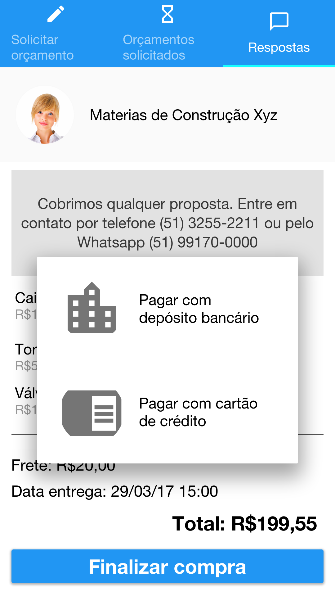

<html><head><meta content="text/html; charset=UTF-8" http-equiv="content-type"></head><body class="c43">
PROJETO - DISCIPLINA PROGRAMA&Ccedil;&Atilde;O PARA WEB III

C&oacute;digo: https://github.com/rhuanbarros/construfacil

<table class="c36"><tbody><tr class="c14"><td class="c10 c25" colspan="1" rowspan="1">
1. &Aacute;REA DE ENQUADRAMENTO (ANEXO I)

As propostas devem estar enquadradas em um dos seguintes temas: 

a) Educa&ccedil;&atilde;o/Ensino; 

b) Sa&uacute;de; 

c) Mobilidade Urbana; 

d) Seguran&ccedil;a P&uacute;blica; 

e) Acessibilidade / Direitos Humanos; 

f) Aferi&ccedil;&atilde;o da qualidade de servi&ccedil;os e pol&iacute;ticas p&uacute;blicas; 

g) Assist&ecirc;ncia Social; 

h) Cultura; 

i) Direitos e defesa do consumidor; 

j) Melhoria da gest&atilde;o no setor p&uacute;blico; 

k) Turismo e Grandes Eventos; 

l) Tratamento de indicadores de pol&iacute;ticas p&uacute;blicas (dados abertos); 

m) Participa&ccedil;&atilde;o Social; 

-&gt; n) Trabalho e Renda; 

o) Meio ambiente.
</td></tr><tr class="c14"><td class="c10" colspan="1" rowspan="1">

Projeto enquadrado na &aacute;rea Trabalho e Renda.

Esta proposta de desenvolvimento foi enquadrada no tema Trabalho e Renda em virtude de ser uma ferramenta de produtividade que auxilia arquitetos, engenheiros e gestores de obras automatizando uma tarefa realizada manualmente, qual seja, a pesquisa de pre&ccedil;os de materiais de constru&ccedil;&atilde;o.

</td></tr><tr class="c14"><td class="c10 c25" colspan="1" rowspan="1">
2. NOME DO PROJETO
</td></tr><tr class="c14"><td class="c10" colspan="1" rowspan="1">

Construf&aacute;cil

</td></tr><tr class="c14"><td class="c10 c25" colspan="1" rowspan="1">
3. BREVE S&Iacute;NTESE DA PROPOSTA

Descreva em apenas um par&aacute;grafo as principais caracter&iacute;sticas do aplicativo, incluindo os aspectos diferenciais e inovadores do projeto.
</td></tr><tr class="c14"><td class="c10" colspan="1" rowspan="1">

Este projeto tem por objetivo desenvolver um aplicativo que permita a engenheiros, arquitetos, pessoas f&iacute;sicas e demais gerentes de obras de constru&ccedil;&atilde;o civil obter or&ccedil;amentos de materiais necess&aacute;rios &agrave; obra, realizar compara&ccedil;&atilde;o de pre&ccedil;os, de prazos de entrega e de demais servi&ccedil;os oferecidos pelas empresas de materiais de constru&ccedil;&atilde;o. 

</td></tr><tr class="c14"><td class="c10 c25" colspan="1" rowspan="1">
4. EQUIPE T&Eacute;CNICA

Participantes da proposta.
</td></tr><tr class="c14"><td class="c10" colspan="1" rowspan="1">

Rhuan Barros

</td></tr><tr class="c14"><td class="c10 c25" colspan="1" rowspan="1">
5. JUSTIFICATIVA DA ADER&Ecirc;NCIA DA PROPOSTA AO TEMA ESCOLHIDO 

Esclare&ccedil;a a rela&ccedil;&atilde;o entre o tema selecionado e a natureza do aplicativo; o n&iacute;vel de explora&ccedil;&atilde;o e aprofundamento do tema selecionado nos conte&uacute;dos, objetos e opera&ccedil;&otilde;es do aplicativo. Preferencialmente, os que relacionaram claramente a mec&acirc;nica/estrutura/intera&ccedil;&atilde;o com a transmiss&atilde;o de informa&ccedil;&otilde;es e contextualiza&ccedil;&atilde;o acerca do tema.
</td></tr><tr class="c14"><td class="c10" colspan="1" rowspan="1">

A tarefa de gerir uma obra de constru&ccedil;&atilde;o civil, como a de uma resid&ecirc;ncia, exige extensa pesquisa de pre&ccedil;os de materiais em diversas lojas especializadas em materiais de constru&ccedil;&atilde;o civil. Essa tarefa de pesquisa pode tomar muito tempo e dinheiro do gestor, pois, da maneira como &eacute; realizada atualmente, &eacute; necess&aacute;rio ir pessoalmente em diversas lojas diferentes. Esse m&eacute;todo pode ser muito custoso.

O aplicativo se prop&otilde;e a facilitar a busca de or&ccedil;amentos e compara&ccedil;&atilde;o de pre&ccedil;os..

Desse modo, um engenheiro que &eacute; gestor de diversas obras ao mesmo tempo pode criar listas de materiais necess&aacute;rios com o endere&ccedil;o de destino e simplesmente aguardar o retorno dos fornecedores.

Com os or&ccedil;amentos, o gestor vai comparar prazos de entrega, disponibilidade em estoque dos materiais, marcas dos itens apresentados.

</td></tr><tr class="c14"><td class="c10 c25" colspan="1" rowspan="1">
6. METODOLOGIA DE EXECU&Ccedil;&Atilde;O

Nesta se&ccedil;&atilde;o defina a forma como o projeto ser&aacute; desenvolvido e monitorado, por exemplo, quais m&eacute;todos, etapas, tarefas e ferramentas de acompanhamento do projeto.
</td></tr><tr class="c14"><td class="c10" colspan="1" rowspan="1"><h3 class="c50" id="h.1wt13ber2lw2">Backlog</h3>
Inicialmente o Backlog foi organizado e certos requisitos foram agrupados por afinidade. Essa organiza&ccedil;&atilde;o sofreu altera&ccedil;&atilde;o conforme o andamento da implementa&ccedil;&atilde;o para melhor se adequar a realidade do desenvolvimento.

Os requisitos est&atilde;o sendo implementados em pequenos sprints ap&oacute;s as aulas da faculdade e tamb&eacute;m nos finais de semana.
<h3 class="c50" id="h.qr7jqokqe13r">Ferramenta de gest&atilde;o</h3>
Estou utilizando a ferramente Moo.do para realizar o controle do Backlog e organiza&ccedil;&atilde;o das prioridades de trabalho.

Esta ferramenta permite a organiza&ccedil;&atilde;o hier&aacute;rquica das tarefas e tamb&eacute;m permite a inser&ccedil;&atilde;o de subtarefas de modo a agrupar os requisitos com afinidade.

<h3 class="c50" id="h.u88ta6wf5zil">Reutiliza&ccedil;&atilde;o de conhecimento</h3>
Este projeto est&aacute; sendo desenvolvido com base no conhecimento adquirido no semestre anterior na disciplina de Engenharia de Software III em 2016/2, na qual foi desenvolvido aplicativo Android com a utiliza&ccedil;&atilde;o do Backend as a Service Google Firebase.

</td></tr><tr class="c14"><td class="c10 c25" colspan="1" rowspan="1">
7. CRONOGRAMA Inclua as atividades de cada uma das etapas do projeto com o prazo de execu&ccedil;&atilde;o para cada uma, com in&iacute;cio e fim, em termos de semanas ou datas completas. &Eacute; necess&aacute;rio um cronograma detalhado do projeto. Voc&ecirc; pode usar aqui um gr&aacute;fico de Gantt.
</td></tr><tr class="c14"><td class="c10" colspan="1" rowspan="1">

<table class="c51"><tbody><tr class="c14"><td class="c26" colspan="1" rowspan="1"><h5 class="c5" id="h.1apcem1wpg4f">Nome</h5></td><td class="c37" colspan="1" rowspan="1"><h5 class="c5" id="h.24dln6qgo7z5">Data inicial</h5></td><td class="c19" colspan="1" rowspan="1"><h5 class="c5" id="h.y5qf26wh4xls">Data final</h5></td><td class="c19" colspan="1" rowspan="1"><h5 class="c5" id="h.y5qf26wh4xls-1">Status</h5></td></tr><tr class="c14"><td class="c26" colspan="1" rowspan="1">
Prot&oacute;tipos das telas
</td><td class="c37" colspan="1" rowspan="1">
20/03/17
</td><td class="c19" colspan="1" rowspan="1">
25/03/17
</td><td class="c19" colspan="1" rowspan="1">
Realizado
</td></tr><tr class="c14"><td class="c26" colspan="1" rowspan="1">
Login
<ul class="c44 lst-kix_gin4ed8o38vu-0 start"><li class="c1 c16">Configura&ccedil;&atilde;o da plataforma</li><li class="c1 c16">Implementa&ccedil;&atilde;o do sistema de login da plataforma Google Firebase&nbsp;o qual permite o login por meio da conta Google.</li></ul></td><td class="c37" colspan="1" rowspan="1">
30/03/17
</td><td class="c19" colspan="1" rowspan="1">
09/04/17
</td><td class="c19" colspan="1" rowspan="1">
Realizado
</td></tr><tr class="c14"><td class="c26" colspan="1" rowspan="1">
Pesquisar item
<ul class="c44 lst-kix_8upwf79t082o-0 start"><li class="c1 c16">pesquisa na internet de planilha contendo lista de materiais de constru&ccedil;&atilde;o</li><li class="c1 c16">constru&ccedil;&atilde;o de banco de dados SQLite com essa lista</li><li class="c1 c16">implanta&ccedil;&atilde;o desse banco de dados dentro do aplicativo de modo ao apk j&aacute; conter o banco de dados pronto (sem a necessidade de &ldquo;insert&rdquo; para cada item de material de constru&ccedil;&atilde;o)</li><li class="c1 c16">implementa&ccedil;&atilde;o do Fragment&nbsp;contendo a lista de materiais do banco de dados SQLite</li><li class="c1 c16">implementada Caixa de Texto que filtra o ListView no Fragment de acordo com o texto digitado</li></ul></td><td class="c37" colspan="1" rowspan="1">
12/04/17
</td><td class="c19" colspan="1" rowspan="1">
24/04/17
</td><td class="c19" colspan="1" rowspan="1">
Realizado
</td></tr><tr class="c14"><td class="c26" colspan="1" rowspan="1">
Inserir/remover item
<ul class="c44 lst-kix_c4rv41d1odf-0 start"><li class="c1 c16">implementada a baixa autom&aacute;tica da lista de itens no banco de dados NoSQL na nuvem do Google Firebase</li></ul><ul class="c44 lst-kix_n08ypsxryu2e-0 start"><li class="c1 c16">implementado o evento que adiciona o item desejado para a lista de itens a ser solicitado or&ccedil;amento por meio de um clique no ListView</li></ul></td><td class="c37" colspan="1" rowspan="1">
08/06/17
</td><td class="c19" colspan="1" rowspan="1">
09/06/17
</td><td class="c19" colspan="1" rowspan="1">
Realizado
</td></tr><tr class="c14"><td class="c26" colspan="1" rowspan="1">
Melhoria na interface e design
<ul class="c44 lst-kix_n929i0l9z76c-0 start"><li class="c1 c16">implementar menu lateral</li></ul></td><td class="c37" colspan="1" rowspan="1">
09/06/17
</td><td class="c19" colspan="1" rowspan="1">
10/06/17
</td><td class="c19" colspan="1" rowspan="1">
Realizado
</td></tr><tr class="c14"><td class="c26" colspan="1" rowspan="1">
Visualizar lista de or&ccedil;amentos solicitados
</td><td class="c37" colspan="1" rowspan="1">
17/06/17
</td><td class="c19" colspan="1" rowspan="1">
19/06/17
</td><td class="c19" colspan="1" rowspan="1">

</td></tr><tr class="c14"><td class="c26" colspan="1" rowspan="1">
Visualizar detalhes or&ccedil;amentos
</td><td class="c37" colspan="1" rowspan="1">
18/06/17
</td><td class="c19" colspan="1" rowspan="1">
19/06/17
</td><td class="c19" colspan="1" rowspan="1">

</td></tr><tr class="c14"><td class="c26" colspan="1" rowspan="1">
Enviar lista para empresas
</td><td class="c37" colspan="1" rowspan="1">
24/06/17
</td><td class="c19" colspan="1" rowspan="1">
25/06/17
</td><td class="c19" colspan="1" rowspan="1">
Realizado
</td></tr><tr class="c14"><td class="c26" colspan="1" rowspan="1">
Ajustes finais
</td><td class="c37" colspan="1" rowspan="1">
01/07/17
</td><td class="c19" colspan="1" rowspan="1">
02/07/17
</td><td class="c19" colspan="1" rowspan="1">

</td></tr></tbody></table>

</td></tr></tbody></table>

<table class="c36"><tbody><tr class="c14"><td class="c10 c25" colspan="1" rowspan="1">
8. DETALHAMENTO DO APLICATIVO 

Descreva todos os elementos e fun&ccedil;&otilde;es pretendidas para o aplicativo e sua intera&ccedil;&atilde;o com o usu&aacute;rio, ilustrando a maneira como deve ser utilizado e o seu potencial de ader&ecirc;ncia com rela&ccedil;&atilde;o &agrave; &aacute;rea tem&aacute;tica escolhida. Devem ser descritos todos os seus conte&uacute;dos e os componentes de sua arquitetura. Se necess&aacute;rio utilize imagens, tabelas e fluxogramas. 
</td></tr><tr class="c14"><td class="c10" colspan="1" rowspan="1">

Hist&oacute;ria de uso do Propriet&aacute;rio/Arquiteto/Engenheiro:

O usu&aacute;rio precisa comprar diversos materiais para sua obra que t&ecirc;m custo consider&aacute;vel, al&eacute;m disso, os valores variam muito de uma loja pra outra. Desse modo, ele faz a pesquisa indo nos lugares e pegando or&ccedil;amento dos materiais pessoalmente, se deslocando de carro. Ou ele pode fazer por email aguardando a resposta dos funcion&aacute;rios.

Hist&oacute;ria de uso do Funcion&aacute;rio da loja de materias de constru&ccedil;&atilde;o:

O usu&aacute;rio precisa atender diversos clientes no balc&atilde;o da loja para apresentar or&ccedil;amentos dos materiais necess&aacute;rios, e tamb&eacute;m acompanha o recebimento de e-mail no computador e os responde. Essa resposta com or&ccedil;amento &eacute; enviada por meio de um arquivo pdf anexado ao email de resposta.

</td></tr><tr class="c14"><td class="c10 c25" colspan="1" rowspan="1">
9. ARQUITETURA DA INFORMA&Ccedil;&Atilde;O

Apresente um diagrama que informe as situa&ccedil;&otilde;es de altera&ccedil;&atilde;o de estados ou segmenta&ccedil;&atilde;o dos conte&uacute;dos do aplicativo, sejam eles p&aacute;ginas ou estados, a sua hierarquia de acessos, os seus atalhos principais, r&oacute;tulos empregados para a sua navega&ccedil;&atilde;o, telas de encerramento, pontua&ccedil;&atilde;o ou configura&ccedil;&atilde;o.
</td></tr><tr class="c14"><td class="c10" colspan="1" rowspan="1">

</td></tr><tr class="c14"><td class="c10 c25" colspan="1" rowspan="1">
10. INTERFACE DE USU&Aacute;RIO

Mostre a estrutura pretendida para a organiza&ccedil;&atilde;o dos elementos visuais da interface do aplicativo ou jogo, informando a maneira como ser&atilde;o dispostos para o usu&aacute;rio. Apresente a rela&ccedil;&atilde;o de dimensionamento e organiza&ccedil;&atilde;o pretendida para os personagens, cen&aacute;rios e displays. Inclua imagens das estruturas da interface (wireframes) e exemplos de interfaces gr&aacute;ficas com imagens das telas do aplicativo.
</td></tr><tr class="c14"><td class="c10" colspan="1" rowspan="1">

Prot&oacute;tipo iniciais - interface idealizada

  Interface atual do aplicativo

</td></tr><tr class="c14"><td class="c10" colspan="1" rowspan="1">
11. CHECKLIST DE FUNCIONALIDADES DO APLICATIVO&nbsp;Especifique cada uma das funcionalidades que ser&atilde;o implementadas no aplicativo.
</td></tr><tr class="c14"><td class="c10" colspan="1" rowspan="1">

<table class="c46"><tbody><tr class="c14"><td class="c6" colspan="1" rowspan="1">
Funcionalidade 1 - Login autom&aacute;tico com a conta do Google
</td></tr><tr class="c14"><td class="c6" colspan="1" rowspan="1">
A primeira tela do aplicativo apresenta a interface de login com um bot&atilde;o para login r&aacute;pido com a conta do Google j&aacute; cadastrada no celular Android. Desse modo, o usu&aacute;rio acessa o aplicativo rapidamente.

Essa funcionalidade tamb&eacute;m &eacute; usada para salvar a lista de materiais atrelada a cada usu&aacute;rio logado.
</td></tr><tr class="c14"><td class="c6" colspan="1" rowspan="1">
Funcionalidade 2 - Banco de dados com lista de materiais utilizados em constru&ccedil;&otilde;es
</td></tr><tr class="c14"><td class="c6" colspan="1" rowspan="1">
Internamente ao aplicativo, foi desenvolvido um banco de dados SQLite que cont&eacute;m os nomes de materiais. O objetivo &eacute; permitir a pesquisa r&aacute;pida de acordo com cada letra que o usu&aacute;rio digita. Al&eacute;m disso, os resultados s&atilde;o exibidos rapidamente, sem a necessidade de &ldquo;loading&rdquo; da internet, pois os dados est&atilde;o internamente no aplicativo.
</td></tr><tr class="c14"><td class="c6" colspan="1" rowspan="1">
Funcionalidade 3 - Pesquisa por nomes de mat&eacute;rias previamente cadastrados
</td></tr><tr class="c14"><td class="c6" colspan="1" rowspan="1">
O aplicativo apresenta uma caixa de texto para o usu&aacute;rio digitar o nome do material que precisa. O filtro seleciona dinamicamente a cada caractere digitado.

Essa funcionalidade &eacute; importante pois impede o usu&aacute;rio de adicionar um item com descri&ccedil;&atilde;o insuficiente ou at&eacute; mesmo incorreta. Isso &eacute; algo que acontece eventualmente na gest&atilde;o de obras.
</td></tr><tr class="c14"><td class="c6" colspan="1" rowspan="1">
Funcionalidade 4 - Adicionar itens &agrave; lista de materiais necess&aacute;rios
</td></tr><tr class="c14"><td class="c6" colspan="1" rowspan="1">
O usu&aacute;rio clica no item que ele deseja e este item &eacute; adicionado &agrave; lista de materiais necess&aacute;rios que se encontra do lado direito do aplicativo. Al&eacute;m disso, essa lista &eacute; salva automaticamente na nuvem.
</td></tr><tr class="c14"><td class="c6" colspan="1" rowspan="1">
Funcionalidade 5 - Salvar o estado da lista se o usu&aacute;rio fechar o aplicativo
</td></tr><tr class="c14"><td class="c6" colspan="1" rowspan="1">
Quando o usu&aacute;rio adiciona um novo item a sua lista de materiais, esse item na verdade &eacute; inserido no banco de dados NoSQL na nuvem do Google Firebase. Desse modo, &eacute; mantido o estado da lista de maneira dur&aacute;vel, atrelado a conta do usu&aacute;rio logado no aplicativo.
</td></tr><tr class="c14"><td class="c6" colspan="1" rowspan="1">
Funcionalidade 6 - Diminuir quantidade necess&aacute;ria
</td></tr><tr class="c14"><td class="c6" colspan="1" rowspan="1">
O usu&aacute;rio pode diminuir a quantidade necess&aacute;ria de materiais para cada item. Essa funcionalidade &eacute; acessada por meio de clique no item na lista da direita.
</td></tr><tr class="c14"><td class="c6" colspan="1" rowspan="1">
Funcionalidade 7 - Envio da lista para as lojas
</td></tr><tr class="c14"><td class="c6" colspan="1" rowspan="1">
Ap&oacute;s a escolha dos itens necess&aacute;rios, o usu&aacute;rio pode enviar a lista para as lojas cadastradas. Esse envio &eacute; realizado por meio de e-mail.
</td></tr><tr class="c14"><td class="c6" colspan="1" rowspan="1">
Funcionalidade 8 - Visualiza&ccedil;&atilde;o das listas j&aacute; enviadas
</td></tr><tr class="c14"><td class="c6" colspan="1" rowspan="1">
Haver&aacute; uma aba no aplicativo de modo ao usu&aacute;rio poder consultar as listas j&aacute; enviadas, funcionando como um hist&oacute;rico das suas listas de materiais j&aacute; enviadas.
</td></tr></tbody></table>

</td></tr><tr class="c14"><td class="c10 c25" colspan="1" rowspan="1">
12. &Aacute;UDIO E M&Uacute;SICA

Descreva as caracter&iacute;sticas de &aacute;udio e m&uacute;sica do aplicativo.
</td></tr><tr class="c14"><td class="c10" colspan="1" rowspan="1">

O aplicativo apresentar&aacute; funcionalidades de &aacute;udio de modo permitir melhor usabilidade a usu&aacute;rios com dificuldades como pouca vis&atilde;o.

Por isso, ser&aacute; utilizado &ldquo;labels&rdquo; descritivos em todos os elementos da interface de modo a permitir que aplicativos leitores de tela, como o TalkBack &nbsp;possam ler esses elementos corretamente.

Referencia: https://material.io/guidelines/usability/accessibility.html#accessibility-color-contrast

</td></tr><tr class="c14"><td class="c10 c25" colspan="1" rowspan="1">
13. ESTILO E REFER&Ecirc;NCIAS

Nesta se&ccedil;&atilde;o, inclua imagens de refer&ecirc;ncias de outros aplicativos que ilustrem a abordagem pretendida para os seus elementos gr&aacute;ficos de maneira que tenham coer&ecirc;ncia interna em termos de cores, tipografia, organiza&ccedil;&atilde;o espacial e outros elementos gr&aacute;ficos.
</td></tr><tr class="c14"><td class="c10" colspan="1" rowspan="1">

A refer&ecirc;ncia de estilo para este projeto ser&aacute; o Material Design do Google (<a class="c55" href="https://www.google.com/url?q=https://material.io/&amp;sa=D&amp;ust=1499148144225000&amp;usg=AFQjCNE4-MyK7KhoX2EdmSoKVNKJ9ry1VA">https://material.io/</a>).

O Material Design &eacute; um framework de estilo, design e usabilidade para ser utilizado em aplicativos de celular e p&aacute;ginas de internet. Ele disponibiliza componentes reutiliz&aacute;veis de estilo pr&oacute;prio do Material Design de modo a manter a coer&ecirc;ncia visual entre os elementos. Al&eacute;m disso, apresenta uma s&eacute;rie de boas pr&aacute;ticas em diagrama&ccedil;&atilde;o de interfaces e tamb&eacute;m dicas para tornar o aplicativo mais acess&iacute;vel a pessoas com dificuldades motoras ou visuais.

</td></tr><tr class="c14"><td class="c10 c25" colspan="1" rowspan="1">
14. FERRAMENTAS, PLUG-INS E DEPEND&Ecirc;NCIAS USADOS NO DESENVOLVIMENTO DO APLICATIVO 

Descreva todas as ferramentas, plug-ins e depend&ecirc;ncias a serem utilizadas no aplicativo.
</td></tr><tr class="c14"><td class="c10" colspan="1" rowspan="1">

Estudo inicial de ferramentas dispon&iacute;veis

Foi realizada extensa pesquisa sobre novas tecnologias dispon&iacute;veis no mercado para desenvolvimento r&aacute;pido de aplicativos para celular. Essa pesquisa focou na busca de tecnologias em conson&acirc;ncia com as Metodologias &Aacute;geis e a metodologia Lean Startup.

Foram pesquisadas tecnologias de back-end tradicionais, como Microsoft .Net, Java, Python, PHP e Ruby on Rails. Dentro da tecnologia Java, foram analisados diversos frameworks web como Spring, Groovy, Play Framework e JHipster.

A partir dessa fase entrei em contato com novas ferramentas e plataformas de desenvolvimento de aplicativos m&oacute;vel chamadas de &ldquo;Mobile Backend As A Service&rdquo; - mBaas. 

Essa tecnologia n&atilde;o tem ainda muita literatura dispon&iacute;vel, nem mesmo em ingl&ecirc;s, por se tratar realmente de tecnologia muito nova e pouco utilizada. Entretanto, s&atilde;o facilmente encontrados diversos artigos sobre o assunto em fontes confi&aacute;veis de consulta. 

Mobile Backend As A Service &eacute; uma plataforma na Nuvem a qual prov&ecirc; um modelo de desenvolvimento &nbsp;&nbsp;&nbsp;&nbsp;&nbsp;&nbsp;&nbsp;&nbsp;baseado na disponibiliza&ccedil;&atilde;o pr&eacute;-pronta de funcionalidade b&aacute;sicas essenciais a maioria dos aplicativos m&oacute;veis.

As funcionalidades pr&eacute;-prontas dispon&iacute;veis s&atilde;o, por exemplo, login integrado a redes sociais, banco de dados com acesso Restful, push notifications e relat&oacute;rios de an&aacute;lise de acesso.

Os principais players nessa &aacute;rea s&atilde;o o Google Firebase, o Amazon AWS Mobile, o Microsoft Azure, Parse Open Source, Apache Usergrid e RedHat Mobile App Platform.

Plataforma escolhida

A plataforma de desenvolvimento escolhida foi o mBaas do Google Firebase devido a grande documenta&ccedil;&atilde;o de sua plataforma, inclusive em portugu&ecirc;s, e a possibilidade de usar a plataforma gratuitamente.

Essa plataforma apresenta uma biblioteca com diversas classes prontas para realizar a conex&atilde;o com todos os recursos dispon&iacute;veis, como o banco de dados e a plataforma de autentica&ccedil;&atilde;o com redes sociais.

Desse modo, para desenvolver este projeto com banco de dados e login na nuvem, foi necess&aacute;rio simplesmente configurar o aplicativo na plataforma e fazer requisi&ccedil;&otilde;es REST ao banco de dados. Isso permitiu manter o foco em programa&ccedil;&atilde;o Java Android para poder desenvolver todas as funcionalidades essenciais.

O banco de dados fornecidos apresenta endpoints REST de modo que com uma linha de c&oacute;digo &eacute; poss&iacute;vel inserir dados no banco de dados. Al&eacute;m disso, com pouco c&oacute;digo foi poss&iacute;vel implementar o banco de dados real time, de modo que qualquer altera&ccedil;&atilde;o &eacute; propagada automaticamente para todos os dispositivos conectados.

Resumo das depend&ecirc;ncias

<table class="c46"><tbody><tr class="c53"><td class="c34" colspan="1" rowspan="3">
Google Firebase
</td><td class="c34" colspan="1" rowspan="1">
Firebase Real Time Database
</td></tr><tr class="c53"><td class="c34" colspan="1" rowspan="1">
Firebase Authentication
</td></tr><tr class="c53"><td class="c34" colspan="1" rowspan="1">
Google Material Design
</td></tr><tr class="c53"><td class="c34" colspan="1" rowspan="1">
http://square.github.io/picasso/
</td><td class="c34" colspan="1" rowspan="1">
Biblioteca que permite o download de imagens e exibi&ccedil;&atilde;o na aplica&ccedil;&atilde;o em apenas uma linha. Se fosse realizar da maneira usual do Android, haveria necessidade de criar uma thread para download da imagem e diversas outras linhas de c&oacute;digo. Enfim, essa biblioteca facilita muita a programa&ccedil;&atilde;o e &eacute; Open Source.
</td></tr><tr class="c53"><td class="c34" colspan="1" rowspan="1">
Javamail-android

https://code.google.com/archive/p/javamail-android/
</td><td class="c34" colspan="1" rowspan="1">
A implementa&ccedil;&atilde;o da funcionalidade de enviar a solicita&ccedil;&atilde;o de or&ccedil;amento por e-mail foi implementada utilizando uma biblioteca de terceiros, em vez de a biblioteca nativa do java para envio de emails por smtp.

Foi realizada extensa pesquisa sobre envio de emails no Android, e a tarefa mais comum &eacute; geralmente a utiliza&ccedil;&atilde;o de um Intent para envio de email pelo aplicativo cliente de email que o usu&aacute;rio j&aacute; tem instalado.

Mas a funcionalidade necess&aacute;ria, na verdade, exige o envio de email em segundo plano, sem interven&ccedil;&atilde;o do usu&aacute;rio.

Al&eacute;m disso, notei que a maioria dos artigos na internet indicava a utiliza&ccedil;&atilde;o desta biblioteca, pois ela havia sido portada para a plataforma do Android de modo a realizar a comunica&ccedil;&atilde;o da melhor maneira poss&iacute;vel.
</td></tr></tbody></table>

</td></tr><tr class="c14"><td class="c10 c25" colspan="1" rowspan="1">
15. IDEIAS ADICIONAIS E OBSERVA&Ccedil;&Otilde;ES

Inclua aqui outras observa&ccedil;&otilde;es quanto ao projeto. Quais os diferenciais pensados para o seu app que outros semelhantes n&atilde;o possuem.
</td></tr><tr class="c14"><td class="c10" colspan="1" rowspan="1">

Este aplicativo se trata de um MVP (Produto M&iacute;nimo Vi&aacute;vel) originado de um projeto maior, com mais funcionalidade, que juntos agregar&atilde;o um valor muito maior ao software. O produto com todas as funcionalidades completas incluiria funcionalidades de recebimento dos or&ccedil;amentos no pr&oacute;prio aplicativo, compara&ccedil;&atilde;o de pre&ccedil;os autom&aacute;ticas, compra por meio de cart&atilde;o de cr&eacute;dito ou dep&oacute;sito, &ldquo;compra 1 click&rdquo; que permitiria a compra de diversos lojas diferentes com o melhor pre&ccedil;o em cada.

Acompanhamento de entrega dos materiais pelo aplicativo e diversas outras.

Entretanto, para iniciar o projeto, foi escolhido desenvolver funcionalidades m&iacute;nimas que permitissem o in&iacute;cio dos testes do aplicativo o mais r&aacute;pido poss&iacute;vel.

Mesmo com as funcionalidades m&iacute;nimas, o aplicativo j&aacute; agrega valor aos gestores de constru&ccedil;&atilde;o, uma vez que ele permite o envio da lista de materiais para diversas lojas de uma vez. 

Outra funcionalidade simples, mas importante, &eacute; a descri&ccedil;&atilde;o correta do material. Isso porque &eacute; muito comum os engenheiros ou mestres de obras enviarem lista com itens significado redundante. Ou seja, na loja, um item escrito na lista pode ser atendido por 2 materiais diferentes.

Escrevendo a lista pelo aplicativo, isso n&atilde;o ser&aacute; um problema, &nbsp;pois o aplicativo cont&eacute;m uma lista de 30 mil itens de modo a permitir a escolha exata do item necess&aacute;rio.

A lista de materiais que comp&otilde;e este aplicativo foi disponibilizada por engenheiro da Cype Engenieros S/A no grupo de discuss&atilde;o de engenharia c&iacute;vil para consulta pelos usu&aacute;rios. Link https://groups.google.com/forum/#!msg/ClubedosEngenheirosCivis/czdyn1qLDcI/asVb6zv3YI0J.

</td></tr></tbody></table>

ANEXO I

Detalhamento dos Temas 

As propostas de projetos devem estar enquadradas em um dos temas a seguir descritos. Ressalte-se que as descri&ccedil;&otilde;es aqui apresentadas s&atilde;o apenas de car&aacute;ter exemplificativo e n&atilde;o restringem a proposi&ccedil;&atilde;o de projetos que n&atilde;o estejam necessariamente nelas inclusos. 

a) Educa&ccedil;&atilde;o / Ensino: enquadram-se neste tema aplicativos que abordem processos de socializa&ccedil;&atilde;o e aprendizagem relacionados ao desenvolvimento intelectual e &eacute;tico de uma pessoa, desde os n&iacute;veis infantil e fundamental at&eacute; os n&iacute;veis superior e de p&oacute;s-gradua&ccedil;&atilde;o. Ou seja, n&atilde;o h&aacute; restri&ccedil;&otilde;es de faixas et&aacute;rias, &aacute;reas do conhecimento ou conte&uacute;dos abordados pelas propostas. Os aplicativos podem ter foco tanto no educando como no educador. Como refer&ecirc;ncia pode-se dar &ecirc;nfase em educa&ccedil;&atilde;o financeira, cultura maker e hacker no ambiente escolar, educa&ccedil;&atilde;o empreendedora, entre outros. 

b) Sa&uacute;de: enquadram-se neste tema aplicativos que abordem assuntos relacionados &agrave; preven&ccedil;&atilde;o de doen&ccedil;as, bem estar, controle da sa&uacute;de, sa&uacute;de coletiva, sa&uacute;de da fam&iacute;lia, monitoramento de pacientes, apoio ao trabalho dos profissionais e/ou institui&ccedil;&otilde;es de sa&uacute;de, dentre outros. 

c) Mobilidade Urbana: enquadram-se neste tema aplicativos que abordem assuntos relacionados a pol&iacute;ticas de transporte e circula&ccedil;&atilde;o que visam &agrave; melhoria da acessibilidade e mobilidade das pessoas e cargas no espa&ccedil;o urbano. Como refer&ecirc;ncia, pode-se propor a prioriza&ccedil;&atilde;o dos modais de transporte coletivo e/ou n&atilde;o motorizados de maneira efetiva, socialmente inclusiva e ecologicamente sustent&aacute;vel ou ainda trabalhar com sugest&otilde;es de melhores rotas a partir de dados de acidentes e incidentes de tr&acirc;nsito. 

d) Seguran&ccedil;a P&uacute;blica: enquadram-se aplicativos relacionados a pol&iacute;ticas p&uacute;blicas de seguran&ccedil;a e que estimulem a parceria entre &oacute;rg&atilde;os do poder p&uacute;blico e sociedade civil na luta por seguran&ccedil;a e qualidade de vida dos cidad&atilde;os brasileiros. 

e) Acessibilidade / Direitos Humanos: enquadram-se nesse tema aplicativos que facilitem a promo&ccedil;&atilde;o e defesa dos direitos humanos de crian&ccedil;as e adolescentes, pessoas com defici&ecirc;ncia, popula&ccedil;&atilde;o em situa&ccedil;&atilde;o de rua, pessoas idosas, popula&ccedil;&atilde;o LGBT, pessoas amea&ccedil;adas de morte, pessoas em situa&ccedil;&atilde;o de trabalho escravo e demais p&uacute;blicos em situa&ccedil;&atilde;o de vulnerabilidade. Como refer&ecirc;ncia, podem ser utilizadas as diretrizes do e-MAG (Modelo de Acessibilidade em Governo Eletr&ocirc;nico). 

f) Aferi&ccedil;&atilde;o da qualidade de servi&ccedil;os e pol&iacute;ticas p&uacute;blicas: enquadram-se nesse tema aplicativos para avaliar os servi&ccedil;os p&uacute;blicos e pol&iacute;ticas p&uacute;blicas por meio de pesquisa de satisfa&ccedil;&atilde;o, com identifica&ccedil;&atilde;o de pontos fracos e de oportunidades de mudan&ccedil;a. Como refer&ecirc;ncia, podem ser utilizadas ferramentas no &acirc;mbito do Programa Gesp&uacute;blica (http://www.gespublica.gov.br/), como o Instrumento Padr&atilde;o de Pesquisa e Satisfa&ccedil;&atilde;o e a Autoavalia&ccedil;&atilde;o da gest&atilde;o p&uacute;blica. 

g) Assist&ecirc;ncia Social: enquadram-se nesse tema aplicativos que visam &agrave; garantia do acesso a recursos m&iacute;nimos e provimento de condi&ccedil;&otilde;es para atender conting&ecirc;ncias sociais e promover a universaliza&ccedil;&atilde;o dos direitos sociais. 

h) Cultura: enquadram-se nesse tema aplicativos relacionados &agrave; promo&ccedil;&atilde;o de manifesta&ccedil;&otilde;es art&iacute;sticas, sociais, lingu&iacute;sticas e comportamentais do povo brasileiro. 

i) Direitos e defesa do consumidor: enquadram-se neste tema aplicativos que abordem assuntos relacionados ao C&oacute;digo de Prote&ccedil;&atilde;o e Defesa do Consumidor (Lei n&ordm; 8.078, de 11 de setembro de 1990) ou normas espec&iacute;ficas como o Regulamento Geral de Direitos do Consumidor de Servi&ccedil;os de Telecomunica&ccedil;&otilde;es (Resolu&ccedil;&atilde;o Anatel n&ordm; 632, de 7 de mar&ccedil;o de 2014). 

j) Melhoria da gest&atilde;o no setor p&uacute;blico: enquadram-se neste tema aplicativos que facilitem a comunica&ccedil;&atilde;o e colabora&ccedil;&atilde;o interna entre servidores ou que promovam a solicita&ccedil;&atilde;o de opera&ccedil;&otilde;es da administra&ccedil;&atilde;o p&uacute;blica por meio de acesso m&oacute;vel (por exemplo: solicita&ccedil;&atilde;o de segunda via de contracheques, pedido de f&eacute;rias, etc). 

k) Turismo e Grandes Eventos: enquadram-se neste tema aplicativos que abordem assuntos relacionados os diferentes setores da cadeia produtiva da atividade &ndash; Marketing e Servi&ccedil;os Tur&iacute;sticos, Agenciamento de Viagens, Transporte, Hotelaria, Gastronomia, Entretenimento e Lazer, Eventos e Confer&ecirc;ncias, Atra&ccedil;&otilde;es Culturais e Ecol&oacute;gicas. 

l) Tratamento de indicadores de pol&iacute;ticas p&uacute;blicas (dados abertos): enquadram-se neste tema aplicativos desenvolvidos a partir do tratamento de dados em formato aberto que estejam relacionados &agrave; an&aacute;lise estat&iacute;stica de dados, correla&ccedil;&atilde;o de indicadores, an&aacute;lise de tend&ecirc;ncia, visualiza&ccedil;&atilde;o de dados, dentre outros. A t&iacute;tulo de exemplo, podem ser utilizados o Portal Brasileiro de Dados Abertos dispon&iacute;vel em http://dados.gov.br/, o Portal de Dados abertos do Minist&eacute;rio das Comunica&ccedil;&otilde;es (http://www.comunicacoes.gov.br/dados), bem como dados disponibilizados em s&iacute;tios de outros &oacute;rg&atilde;os da Administra&ccedil;&atilde;o P&uacute;blica. 

m) Participa&ccedil;&atilde;o Social: enquadram-se neste tema aplicativos que promovam a intera&ccedil;&atilde;o entre a sociedade e a Administra&ccedil;&atilde;o P&uacute;blica nas diversas etapas do ciclo de pol&iacute;tica p&uacute;blica e presta&ccedil;&atilde;o de servi&ccedil;os. 

n) Trabalho e Renda: enquadram-se neste tema aplicativos que facilitassem o aceso &agrave;s informa&ccedil;&otilde;es de intermedia&ccedil;&atilde;o de emprego (SINE - Sistema Nacional de Emprego), &agrave;s ofertas das institui&ccedil;&otilde;es de ensino t&eacute;cnico ou cursos de forma&ccedil;&atilde;o profissional (Sistema S ou Pronatec, por exemplo), assim como outras a&ccedil;&otilde;es p&uacute;blicas ou privadas que oportunizem o acesso ao trabalho e &agrave; renda. 

o) Meio ambiente:&nbsp;enquadram-se nesse tema aplicativos que promovam a preserva&ccedil;&atilde;o de ecossistemas e da vida. Como refer&ecirc;ncia, pode-se trabalhar aplicativos que facilitam a reutiliza&ccedil;&atilde;o e a reciclagem de res&iacute;duos s&oacute;lidos.
</body></html>